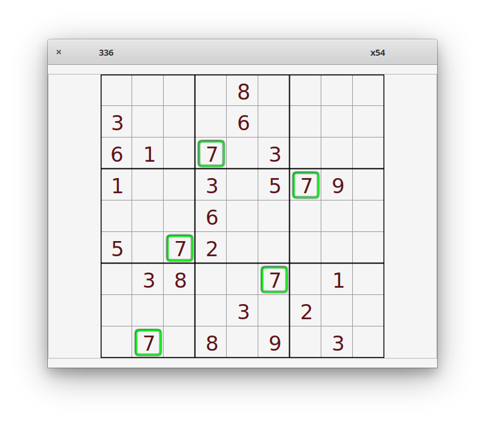

# Sudoku

### The number that is alone





## Installation
[](https://appcenter.elementary.io/com.github.parnold-x.sudoku)


## Building
Dependencies:
* valac
* glib-2.0
* gee-0.8
* gtk+-3.0
* granite
* qqwing
 
then build with:
 
```
meson build --prefix=/usr
cd build
sudo ninja install
```
